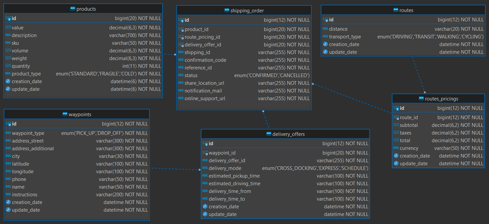

# db_PedidosYaEnvios_mysql
Base de Datos para la gestión de envíos, productos, puntos, rutas, etc, ejemplificando parte de la arquitectura de datos de PedidosYa Envíos.

* [ApiRest_PedidosYaEnvios_NestJS_Public](https://github.com/andresWeitzel/ApiRest_PedidosYaEnvios_NestJS)
* [Documentación PedidosYaEnvíos](https://developers.pedidosya.com/courier-api/v3#tag/Shippings/paths/~1v3~1shippings~1estimates/post)
* [Datos de ejemplos para productos](https://www.pedidosya.com.ar/restaurantes/buenos-aires/fabric-caballito-parque-menu?origin=shop_list)
* [Datos de ejemplos para restaurantes](https://www.pedidosya.com.ar/restaurantes/tigre)

